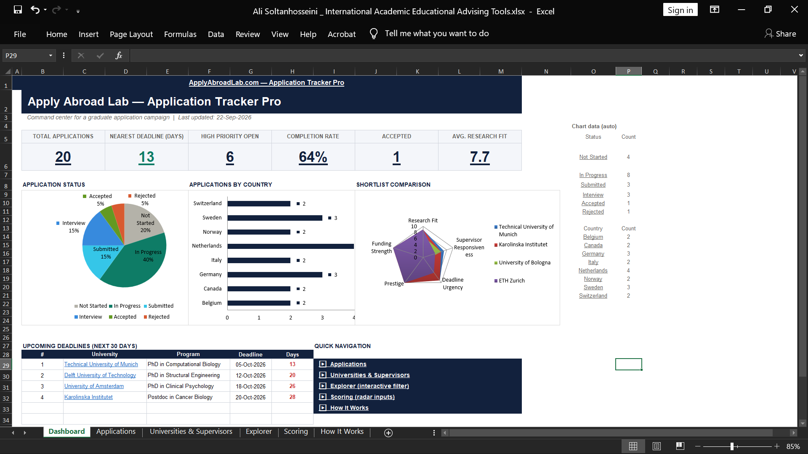
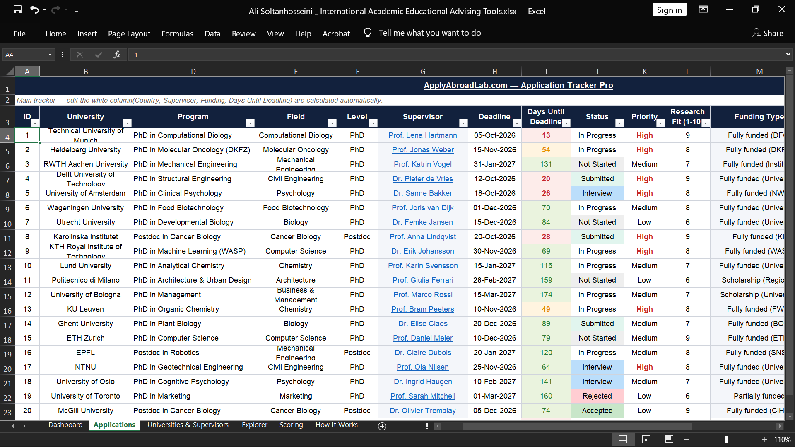
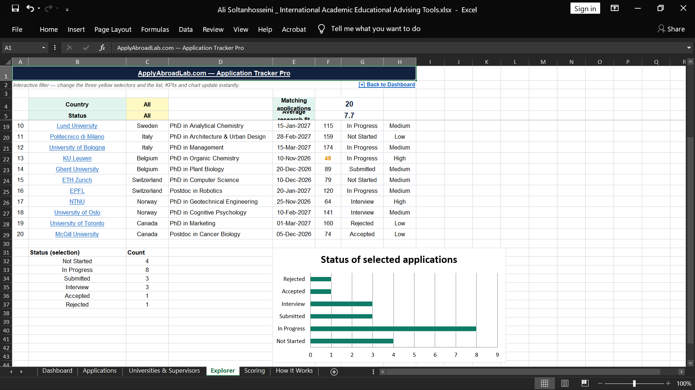
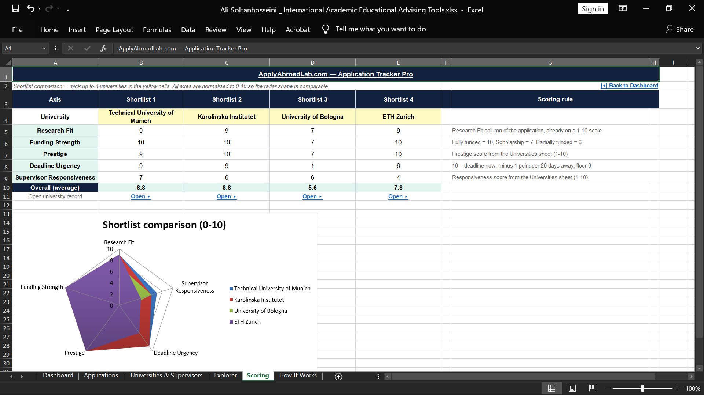

# Academic Application Tracker Pro

A formula-driven Excel tracker for managing Master's, PhD and Postdoc application campaigns across multiple countries — built as an internal tool for [Apply Abroad Lab](https://applyabroadlab.com/) and released here as a free template for other advisors and applicants.

The workbook is not hand-built: it is generated by a small Python script (`generator/`), so every KPI, chart and dropdown is reproducible and easy to extend. No macros, no external connections — it opens and works fully offline in Excel 2016 or later.

\
| Dashboard | Applications |
|---|---|
|  |  |

| Explorer | Scoring |
|---|---|
|  |  |

## Who this is for

- Academic advisors and study-abroad consultants tracking multiple clients' applications
- PhD, Postdoc and Master's applicants managing their own multi-country campaign
- Anyone who wants a live Excel dashboard (KPIs, charts, deadline alerts) without learning Power BI or Google Apps Script

## Features

- **Live KPI dashboard** — total applications, nearest deadline, high-priority items still open, completion rate, accepted count, average research fit
- **Automatic deadline countdown** with red / orange / green alerts as a deadline approaches
- **Reference table** for universities and supervisors — enter a university once, and its country, supervisor and funding type auto-fill on every application via `INDEX` / `MATCH`
- **Interactive Explorer** — filter by country, status and priority; the list, four KPIs and a bar chart update instantly
- **Shortlist comparison** — a normalised 0–10 radar chart comparing up to four universities across research fit, funding strength, prestige, deadline urgency and supervisor responsiveness
- **Click-through navigation** — every underlined number or name is a link: KPI cards and chart-data labels open the Applications sheet, deadline and Explorer rows open the exact application row, the Supervisor column and the Scoring sheet open the university record, and every sheet has a Back to Dashboard link
- **Data validation throughout** — status, priority, level, field and research-fit score are all dropdown- or range-limited, so charts and KPIs stay reliable
- **Zero formula errors** — every formula is Excel-2007-era or `openpyxl`-safe (no `XLOOKUP`/`FILTER`/`UNIQUE`, which some renderers evaluate incorrectly)

## Quick start

1. Download `templates/Application-Tracker-Pro-Blank.xlsx`
2. Open the **Universities & Supervisors** sheet and replace the example row with your own target institutions
3. Open the **Applications** sheet and start adding applications — pick the university from the dropdown, everything else follows
4. Open **Dashboard** to see your KPIs and charts update live

Want to see it fully populated first? Open `templates/Application-Tracker-Pro-Sample.xlsx` — the same workbook with 20 example applications already filled in.

## How it's built

`generator/build_full_example.py` and `generator/build_blank_template.py` are standalone Python scripts (`openpyxl`) that generate the two `.xlsx` files in `templates/`. They are a useful reference if you want to:

- adapt the tracker to a different field (e.g. undergraduate admissions, grant applications)
- understand exactly how the automated columns, conditional formatting and charts are constructed
- regenerate the workbook after changing the color scheme, fields, or sheet structure

```bash
pip install openpyxl
python generator/build_full_example.py      # writes templates/Application-Tracker-Pro-Sample.xlsx
python generator/build_blank_template.py    # writes templates/Application-Tracker-Pro-Blank.xlsx
```

If you recalculate the generated files with LibreOffice before opening them in Excel, run `python generator/fix_links.py templates/*.xlsx` afterwards. LibreOffice rewrites in-workbook links as links to the file by name, which makes Excel show a security notice once the file is renamed or moved; the script turns them back into pure internal links.

## Structure

| Sheet | Purpose |
|---|---|
| Dashboard | Live KPIs, three charts, upcoming-deadline list, navigation |
| Applications | Main tracker — one row per application |
| Universities & Supervisors | Reference table — one row per institution |
| Explorer | Interactive filter by country / status / priority |
| Scoring | Normalised shortlist comparison feeding the radar chart |
| How It Works | One-page guide for a non-technical user, including how the click-through links behave |

## License

MIT — free for personal and commercial use.

## Built by

[Apply Abroad Lab](https://applyabroadlab.com/) — academic advising for graduate and postdoctoral applicants.
Connect on [LinkedIn](https://www.linkedin.com/in/ali-soltanhosseini-aut/).
